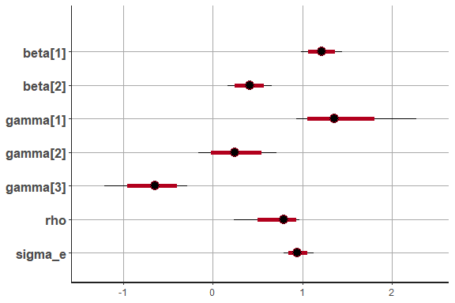

<!--  README.md is generated from README.Rmd. Please edit that file -->

# HeckmanStan

<!--[]()-->

The Heckman selection model is widely employed in econometric analysis
and other social sciences, to address sample selection issues in data
modeling. In this work, we explore these selection models using a
Bayesian approach facilitated by the Stan software.

For more information about the model formulation and estimation, please see
Heeju Lim, Victor E. Lachos, and Victor H. Lachos (2025). Bayesian analysis of flexible Heckman selection models using Hamiltonian Monte Carlo. **. DOI: [arXiv:2510.20942](https://doi.org/10.48550/arXiv.2510.20942)

For the classical Heckman model estimated via the EM algorithm, see Heeju Lim, José Alejandro Ordoñezb, Antonio Punzoc*, and Victor H. Lachos (2025), Heckman Selection Contaminated Normal Model. [https://doi.org/10.1080/10618600.2025.2576165](https://www.tandfonline.com/doi/full/10.1080/10618600.2025.2576165).

You can install the released version of CRAN package from [CRAN](https://cran.r-project.org/web/packages/HeckmanStan/index.html)
``` r
install.packages("HeckmanStan")
```

You can install HeckmanStan from GitHub with:

``` r
remotes::install_github("heeju-lim/HeckmanStan")
```


## Basic Features HeckmanStan()

The package contains main function named HeckmanStan().

``` r
Fit <- HeckmanStan(y, x, w, cc, family = "CN", thin = 5, init = "random", chains = 1, iter = 10, warmup = 5)
```

- y : A response vector.

- x : A covariate matrix for the response y.

- w : A covariate matrix for the missing indicator cc.

- cc :A missing indicator vector (1=observed, 0=missing) .

- family: The family to be used (Normal, T or CN).

- init : Parameters specifies the initial values for model parameters.

- thin : An Interval at which samples are retained from the MCMC process
  to reduce autocorrelation.

- chains : The number of chains to run during the MCMC sampling. Running
  multiple chains is useful for checking convergence.

- iter : The total number of iterations for the MCMC sampling,
  determining how many samples will be drawn.

- warmup : The number of initial iterations that will be discarded as
  the algorithm stabilizes before collecting samples.

Fit\[\[1\]\] contains the inference of Stan model and EAIC and EBIC.

Fit\[\[2\]\] contains the HPC confidence interval and Looic, WAIC, and
CPO.

## Example

This is a basic example which shows you how to fit the Heckman Stan
Model when data is generated from the normal distribution and fit the
Heckmans Stan model using the contaminated normal distribution.

``` r
library(HeckmanStan)
n<- 100
w<- cbind(1,rnorm(n),rnorm(n))
x<- cbind(w[,1:2])
type="CN"
sigma2<- 1
rho<-0.7
beta<- c(1,0.5)
gama<- c(1,0.3,-.5)
nu=c(0.1,0.1)
data<-geraHeckman(x,w,beta,gama,sigma2,rho,nu,type=type)
y<-data$y
cc<-data$cc
# Fit Heckman Normal Stan model
fit.n_stan <- HeckmanStan(y, x, w, cc, family="CN", thin = 5, chains = 1, iter = 10000, warmup = 1000)
#> 
#> SAMPLING FOR MODEL 'anon_model' NOW (CHAIN 1).
#> Chain 1: Rejecting initial value:
#> Chain 1:   Log probability evaluates to log(0), i.e. negative infinity.
#> Chain 1:   Stan can't start sampling from this initial value.
#> Chain 1: 
#> Chain 1: Gradient evaluation took 0.00016 seconds
#> Chain 1: 1000 transitions using 10 leapfrog steps per transition would take 1.6 seconds.
#> Chain 1: Adjust your expectations accordingly!
#> Chain 1: 
#> Chain 1: 
#> Chain 1: Iteration:    1 / 10000 [  0%]  (Warmup)
#> Chain 1: Iteration: 1000 / 10000 [ 10%]  (Warmup)
#> Chain 1: Iteration: 1001 / 10000 [ 10%]  (Sampling)
#> Chain 1: Iteration: 2000 / 10000 [ 20%]  (Sampling)
#> Chain 1: Iteration: 3000 / 10000 [ 30%]  (Sampling)
#> Chain 1: Iteration: 4000 / 10000 [ 40%]  (Sampling)
#> Chain 1: Iteration: 5000 / 10000 [ 50%]  (Sampling)
#> Chain 1: Iteration: 6000 / 10000 [ 60%]  (Sampling)
#> Chain 1: Iteration: 7000 / 10000 [ 70%]  (Sampling)
#> Chain 1: Iteration: 8000 / 10000 [ 80%]  (Sampling)
#> Chain 1: Iteration: 9000 / 10000 [ 90%]  (Sampling)
#> Chain 1: Iteration: 10000 / 10000 [100%]  (Sampling)
#> Chain 1: 
#> Chain 1:  Elapsed Time: 1.396 seconds (Warm-up)
#> Chain 1:                11.591 seconds (Sampling)
#> Chain 1:                12.987 seconds (Total)
#> Chain 1: 
#> 
#> -------------------------------------------------------------
#> Posterior mean(Mean), standard deviation(Sd) and HPD interval
#> -------------------------------------------------------------
#>              Mean      Sd  HPD(95%) Lower Upper Bound
#> beta[1]   1.21401 0.11815         0.98264     1.43754
#> beta[2]   0.40689 0.13689         0.14507     0.64953
#> gamma[1]  1.40562 0.33846         0.87923     2.07404
#> gamma[2]  0.25034 0.22668        -0.15919     0.71281
#> gamma[3] -0.66434 0.23683        -1.11888    -0.23970
#> rho       0.74702 0.18564         0.37917     0.99399
#> sigma_e   0.94611 0.08589         0.79208     1.12578
#> nu1       0.06450 0.04831         0.01002     0.15083
#> nu2       0.03786 0.02506         0.01001     0.08638
#> sigma2    0.90249 0.16518         0.59309     1.22163
#> -------------------------------------------------------------
#> Model selection criteria
#> ----------------------------------------
#>          Looic     WAIC      CPO
#> Value 317.5921 316.3856 -159.264
#> ----------------------------------------
#> 
```

``` r
qoi=c("beta","gamma","sigma_e","sigma2", "rho","EAIC","EBIC")
print(fit.n_stan[[1]],par=qoi)
#> Inference for Stan model: anon_model.
#> 1 chains, each with iter=10000; warmup=1000; thin=5; 
#> post-warmup draws per chain=1800, total post-warmup draws=1800.
#> 
#>            mean se_mean   sd   2.5%    25%    50%    75%  97.5% n_eff Rhat
#> beta[1]    1.21    0.00 0.12   0.98   1.14   1.21   1.29   1.44  1736    1
#> beta[2]    0.41    0.00 0.13   0.16   0.32   0.41   0.49   0.66  1721    1
#> gamma[1]   1.41    0.01 0.34   0.93   1.20   1.35   1.56   2.27  1488    1
#> gamma[2]   0.26    0.01 0.23  -0.16   0.11   0.25   0.39   0.71  1780    1
#> gamma[3]  -0.67    0.01 0.24  -1.21  -0.79  -0.64  -0.51  -0.28  1570    1
#> sigma_e    0.94    0.00 0.09   0.79   0.89   0.94   1.00   1.12  1724    1
#> sigma2     0.90    0.00 0.16   0.62   0.78   0.88   1.00   1.26  1698    1
#> rho        0.75    0.00 0.19   0.24   0.67   0.79   0.88   0.96  1536    1
#> EAIC     325.66    0.12 5.16 318.10 321.85 324.76 328.60 337.94  1848    1
#> EBIC     349.11    0.12 5.16 341.55 345.30 348.21 352.04 361.39  1848    1
#> 
#> Samples were drawn using NUTS(diag_e) at Fri Nov  1 13:33:12 2024.
#> For each parameter, n_eff is a crude measure of effective sample size,
#> and Rhat is the potential scale reduction factor on split chains (at 
#> convergence, Rhat=1).
```

``` r
print(fit.n_stan[[2]])
#> [[1]]
#>                 Mean         Sd  HPD(95%) Lower Upper Bound
#> beta[1]   1.21401094 0.11814762      0.98263649  1.43754095
#> beta[2]   0.40688759 0.13689169      0.14506798  0.64953153
#> gamma[1]  1.40562284 0.33846174      0.87923184  2.07404013
#> gamma[2]  0.25033910 0.22667517     -0.15919142  0.71281078
#> gamma[3] -0.66433824 0.23682703     -1.11888309 -0.23970452
#> rho       0.74701942 0.18564096      0.37917493  0.99398854
#> sigma_e   0.94610624 0.08589278      0.79208339  1.12577878
#> nu1       0.06449536 0.04831229      0.01002479  0.15083094
#> nu2       0.03785999 0.02505889      0.01000995  0.08637778
#> sigma2    0.90249089 0.16518206      0.59309081  1.22163110
#> 
#> [[2]]
#>          Looic     WAIC      CPO
#> Value 317.5921 316.3856 -159.264
```

``` r

# Plots for stanfit objects : 
library(rstan)
plot(fit.n_stan[[1]], pars=c("beta[1]","beta[2]", "gamma[1]", "gamma[2]", "gamma[3]", "rho", "sigma_e"))
```



``` r
plot(fit.n_stan[[1]], plotfun="hist", pars=c("beta[1]","beta[2]", "gamma[1]", "gamma[2]", "gamma[3]", "rho", "sigma_e"))
```


``` r
plot(fit.n_stan[[1]], plotfun="trace", pars=c("beta[1]","beta[2]", "gamma[1]", "gamma[2]", "gamma[3]", "rho", "sigma_e"))
```


