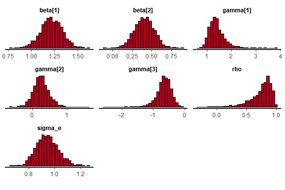

<!--  README.md is generated from README.Rmd. Please edit that file -->

# HeckmanStan

<!--[]()-->

The Heckman selection model is widely employed in econometric analysis
and other social sciences, to address sample selection issues in data
modeling. Its fundamental assumption hinges on the normality of error
terms in both the outcome and the sample selection equations.

In this work, we explore these selection models using a Bayesian
approach facilitated by the Stan software. Our objective is to compare
the performance of the normal, Student’s-t and contaminated normal,
aiming to address the complexities introduced by non-standard error
distributions.

<!--For more information about the model formulation and estimation, please see
Schumacher, F. L., Lachos, V. H., and Matos, L. A. (2021). Scale mixture of skew‐normal linear mixed models with within‐subject serial dependence. *Statistics in Medicine*. DOI: [10.1002/sim.8870](https://doi.org/10.1002/sim.8870).-->

## Installation

<!-- You can install the released version of lmmsmsn from [CRAN](https://CRAN.R-project.org) with: -->

You can install HeckmanStan from GitHub with:

``` r
remotes::install_github("heeju-lim/HeckmanStan")
```

Or you can install the released version of skewlmm from
[CRAN](https://CRAN.R-project.org) with:

``` r
install.packages("HeckmanStan")
```

## Example

This is a basic example which shows you how to fit the Heckman Stan
Model when data is generated from the normal distribution and fit the
Heckmans Stan model using the contaminated normal distribution.

``` r
library(HeckmanStan)
n<- 100
w<- cbind(1,rnorm(n),rnorm(n))
x<- cbind(w[,1:2])
type="CN"
sigma2<- 1
rho<-0.7
beta<- c(1,0.5)
gama<- c(1,0.3,-.5)
nu=c(0.1,0.1)
data<-geraHeckman(x,w,beta,gama,sigma2,rho,nu,type=type)
y<-data$y
cc<-data$cc
# Fit Heckman Normal Stan model
fit.n_stan <- HeckmanStan(y, x, w, cc, family="CN", thin = 5, chains = 1, iter = 1000, warmup = 100)
#> 
#> SAMPLING FOR MODEL 'anon_model' NOW (CHAIN 1).
#> Chain 1: 
#> Chain 1: Gradient evaluation took 0.000162 seconds
#> Chain 1: 1000 transitions using 10 leapfrog steps per transition would take 1.62 seconds.
#> Chain 1: Adjust your expectations accordingly!
#> Chain 1: 
#> Chain 1: 
#> Chain 1: WARNING: There aren't enough warmup iterations to fit the
#> Chain 1:          three stages of adaptation as currently configured.
#> Chain 1:          Reducing each adaptation stage to 15%/75%/10% of
#> Chain 1:          the given number of warmup iterations:
#> Chain 1:            init_buffer = 15
#> Chain 1:            adapt_window = 75
#> Chain 1:            term_buffer = 10
#> Chain 1: 
#> Chain 1: Iteration:   1 / 1000 [  0%]  (Warmup)
#> Chain 1: Iteration: 100 / 1000 [ 10%]  (Warmup)
#> Chain 1: Iteration: 101 / 1000 [ 10%]  (Sampling)
#> Chain 1: Iteration: 200 / 1000 [ 20%]  (Sampling)
#> Chain 1: Iteration: 300 / 1000 [ 30%]  (Sampling)
#> Chain 1: Iteration: 400 / 1000 [ 40%]  (Sampling)
#> Chain 1: Iteration: 500 / 1000 [ 50%]  (Sampling)
#> Chain 1: Iteration: 600 / 1000 [ 60%]  (Sampling)
#> Chain 1: Iteration: 700 / 1000 [ 70%]  (Sampling)
#> Chain 1: Iteration: 800 / 1000 [ 80%]  (Sampling)
#> Chain 1: Iteration: 900 / 1000 [ 90%]  (Sampling)
#> Chain 1: Iteration: 1000 / 1000 [100%]  (Sampling)
#> Chain 1: 
#> Chain 1:  Elapsed Time: 0.593 seconds (Warm-up)
#> Chain 1:                4.427 seconds (Sampling)
#> Chain 1:                5.02 seconds (Total)
#> Chain 1:
#> Warning: Bulk Effective Samples Size (ESS) is too low, indicating posterior means and medians may be unreliable.
#> Running the chains for more iterations may help. See
#> https://mc-stan.org/misc/warnings.html#bulk-ess
#> Warning: Tail Effective Samples Size (ESS) is too low, indicating posterior variances and tail quantiles may be unreliable.
#> Running the chains for more iterations may help. See
#> https://mc-stan.org/misc/warnings.html#tail-ess
#> 
#> -------------------------------------------------------------
#> Posterior mean(Mean), standard deviation(Sd) and HPD interval
#> -------------------------------------------------------------
#>              Mean      Sd  HPD(95%) Lower Upper Bound
#> beta[1]   1.15803 0.22358         0.73111     1.53031
#> beta[2]   0.63394 0.13277         0.41140     0.92528
#> gamma[1]  2.30231 1.73986         0.74348     6.12170
#> gamma[2]  0.89811 0.77234         0.05389     2.76841
#> gamma[3] -0.88789 0.87965        -2.64648     0.02011
#> rho       0.08073 0.43909        -0.69911     0.79715
#> sigma_e   0.64649 0.29600         0.11695     1.10297
#> nu1       0.67827 0.26744         0.09339     0.97853
#> nu2       0.31764 0.26484         0.01145     0.86242
#> sigma2    0.50512 0.38861         0.01368     1.21655
#> -------------------------------------------------------------
#> Warning: Some Pareto k diagnostic values are too high. See help('pareto-k-diagnostic') for details.
#> Warning: 
#> 2 (2.0%) p_waic estimates greater than 0.4. We recommend trying loo instead.
#> Model selection criteria
#> ----------------------------------------
#>         Looic    WAIC       CPO
#> Value 336.628 336.469 -168.4161
#> ----------------------------------------
#> 
```

``` r
qoi=c("beta","gamma","sigma_e","sigma2", "rho","EAIC","EBIC")
print(fit.n_stan[[1]],par=qoi)
#> Inference for Stan model: anon_model.
#> 1 chains, each with iter=1000; warmup=100; thin=5; 
#> post-warmup draws per chain=180, total post-warmup draws=180.
#> 
#>            mean se_mean   sd   2.5%    25%    50%    75%  97.5% n_eff Rhat
#> beta[1]    1.15    0.02 0.21   0.74   1.01   1.15   1.31   1.52   142 1.00
#> beta[2]    0.63    0.01 0.13   0.40   0.55   0.64   0.71   0.89   202 1.01
#> gamma[1]   2.27    0.25 1.76   0.88   1.18   1.60   2.58   7.82    49 1.02
#> gamma[2]   0.89    0.09 0.77   0.17   0.39   0.64   1.06   2.94    72 1.00
#> gamma[3]  -0.89    0.11 0.91  -4.31  -0.99  -0.62  -0.45  -0.16    67 1.02
#> sigma_e    0.65    0.03 0.29   0.14   0.41   0.67   0.90   1.17    78 1.00
#> sigma2     0.51    0.04 0.39   0.02   0.17   0.45   0.80   1.36    92 0.99
#> rho        0.08    0.03 0.44  -0.70  -0.25   0.07   0.47   0.79   168 1.00
#> EAIC     345.81    0.30 3.51 340.83 343.31 345.24 347.54 353.62   135 1.00
#> EBIC     369.26    0.30 3.51 364.27 366.76 368.68 370.99 377.07   135 1.00
#> 
#> Samples were drawn using NUTS(diag_e) at Tue Oct 22 18:42:58 2024.
#> For each parameter, n_eff is a crude measure of effective sample size,
#> and Rhat is the potential scale reduction factor on split chains (at 
#> convergence, Rhat=1).
```

``` r
print(fit.n_stan[[2]])
#> [[1]]
#>                 Mean        Sd  HPD(95%) Lower Upper Bound
#> beta[1]   1.15803223 0.2235762      0.73111230  1.53030916
#> beta[2]   0.63394482 0.1327733      0.41139882  0.92528251
#> gamma[1]  2.30231085 1.7398601      0.74347670  6.12169712
#> gamma[2]  0.89811077 0.7723436      0.05388669  2.76840545
#> gamma[3] -0.88789374 0.8796487     -2.64647972  0.02010856
#> rho       0.08072884 0.4390871     -0.69910687  0.79715153
#> sigma_e   0.64648861 0.2959963      0.11695382  1.10297448
#> nu1       0.67826543 0.2674404      0.09338587  0.97852764
#> nu2       0.31763765 0.2648374      0.01144771  0.86242433
#> sigma2    0.50512327 0.3886078      0.01367819  1.21655269
#> 
#> [[2]]
#>         Looic    WAIC       CPO
#> Value 336.628 336.469 -168.4161
```

``` r

# Plots for stanfit objects : 
library(rstan)
#> 필요한 패키지를 로딩중입니다: StanHeaders
#> 
#> rstan version 2.32.6 (Stan version 2.32.2)
#> For execution on a local, multicore CPU with excess RAM we recommend calling
#> options(mc.cores = parallel::detectCores()).
#> To avoid recompilation of unchanged Stan programs, we recommend calling
#> rstan_options(auto_write = TRUE)
#> For within-chain threading using `reduce_sum()` or `map_rect()` Stan functions,
#> change `threads_per_chain` option:
#> rstan_options(threads_per_chain = 1)
#> Do not specify '-march=native' in 'LOCAL_CPPFLAGS' or a Makevars file
```

``` r
plot(fit.n_stan[[1]], pars=c("beta[1]","beta[2]", "gamma[1]", "gamma[2]", "gamma[3]", "rho", "sigma_e"))
#> ci_level: 0.8 (80% intervals)
#> outer_level: 0.95 (95% intervals)
```


``` r
plot(fit.n_stan[[1]], plotfun="hist", pars=c("beta[1]","beta[2]", "gamma[1]", "gamma[2]", "gamma[3]", "rho", "sigma_e"))
#> `stat_bin()` using `bins = 30`. Pick better value with `binwidth`.
```



``` r
plot(fit.n_stan[[1]], plotfun="trace", pars=c("beta[1]","beta[2]", "gamma[1]", "gamma[2]", "gamma[3]", "rho", "sigma_e"))
```


